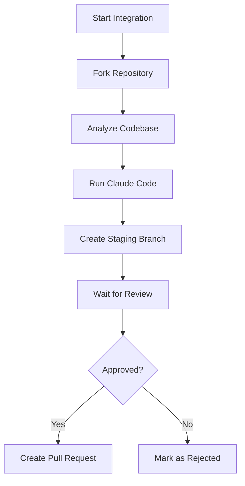

# Helicone Temporal Integration

Automated system for integrating Helicone observability into open-source LLM projects using Temporal workflows and Claude Code.

## Overview

This service automates the process of:
1. Identifying suitable open-source repositories using LLMs
2. Forking and analyzing the codebase
3. Using Claude Code to generate Helicone integration code
4. Creating staging branches for review
5. Submitting pull requests after approval

## Architecture

- **Temporal Workflows**: Orchestrates the multi-step integration process
- **Claude Code**: Generates the actual integration code
- **GitHub API**: Manages forks, branches, and pull requests
- **Review Dashboard**: Human-in-the-loop approval system

## Setup

### Prerequisites

- Node.js 20+
- Docker & Docker Compose
- GitHub Personal Access Token
- Anthropic API Key (for Claude Code)

### Local Development

1. Clone and install dependencies:
```bash
npm install
```

2. Copy environment variables:
```bash
cp .env.example .env
# Edit .env with your tokens
```

3. Start Temporal and the worker:
```bash
docker-compose up
```

4. In another terminal, start a workflow:
```bash
npm run workflow
```

### Production Deployment

1. Set up Temporal Cloud account
2. Deploy worker to Cloud Run/ECS/K8s
3. Configure environment variables
4. Connect to Temporal Cloud namespace

## Workflow



## API

### Start Integration Workflow

```typescript
const handle = await client.workflow.start(repositoryIntegrationWorkflow, {
  args: [{
    repoUrl: 'https://github.com/owner/repo',
    repoOwner: 'owner',
    repoName: 'repo',
    integrationId: 'unique-id',
  }],
  taskQueue: 'helicone-integration',
  workflowId: `integration-${integrationId}`,
});
```

### Send Review Decision

```typescript
await handle.signal(reviewCompleteSignal, {
  approved: true,
  feedback: 'Looks good!',
});
```

## Development

### Running Tests
```bash
npm test
```

### Building
```bash
npm run build
```

### Linting
```bash
npm run lint
```

## Environment Variables

- `GITHUB_TOKEN`: GitHub Personal Access Token with repo permissions
- `ANTHROPIC_API_KEY`: API key for Claude Code
- `TEMPORAL_ADDRESS`: Temporal server address (default: localhost:7233)
- `HELICONE_API_URL`: Helicone API endpoint for status updates
- `HELICONE_API_KEY`: Helicone API key

## License

MIT