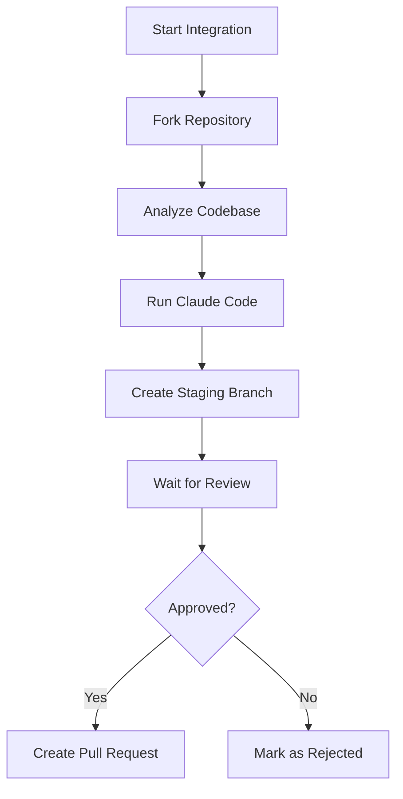

# Helicone Temporal Integration

Automated system for integrating Helicone observability into open-source LLM projects using Temporal workflows and Claude Code.

## Overview

This service automates the process of:
1. Identifying suitable open-source repositories using LLMs
2. Forking and analyzing the codebase
3. Using Claude Code to generate Helicone integration code
4. Creating staging branches for review
5. Submitting pull requests after approval

## Architecture

- **Temporal Workflows**: Orchestrates the multi-step integration process
- **Claude Code**: Generates the actual integration code
- **GitHub API**: Manages forks, branches, and pull requests
- **Review Dashboard**: Human-in-the-loop approval system

## Setup

### Prerequisites

- Node.js 20+
- Temporal CLI (`brew install temporal` or [download](https://temporal.io/downloads))
- GitHub Personal Access Token
- Anthropic API Key (for Claude Code)

### Local Development

1. Clone and install dependencies:
```bash
npm install
```

2. Copy environment variables:
```bash
cp .env.example .env
# Edit .env with your tokens
```

3. Start Temporal using the CLI (in a separate terminal):
```bash
temporal server start-dev
```
This starts Temporal on http://localhost:7233 and the UI on http://localhost:8233

4. Build the TypeScript code:
```bash
npm run build
```

5. Start the worker (in another terminal):
```bash
npm start
```

6. Run a workflow (in another terminal):
```bash
# Default test repo
npm run workflow

# Or specify a GitHub repo
npm run workflow https://github.com/calcom/cal.com
```

### Monitoring Workflows

1. **View in Temporal UI**: Open http://localhost:8233 to see:
   - Running workflows
   - Workflow history
   - Activity executions
   - Worker status

2. **Check logs**: The worker terminal shows:
   - Activity execution logs
   - Claude Code output
   - Git operations

3. **Workflow states**:
   - `forking` - Creating GitHub fork
   - `cloning` - Cloning repository
   - `integrating` - Running Claude Code
   - `pushing` - Creating staging branch
   - `creating_review_pr` - Creating PR in your fork
   - `awaiting_review` - Waiting for your review
   - `creating_pr` - Creating final PR
   - `completed` - Success!
   - `rejected` - Changes rejected
   - `failed` - Check logs for errors

### Reviewing Changes

When a workflow reaches the `awaiting_review` state, it creates a PR in your fork and waits for your review.

#### Option 1: Using the CLI

```bash
# Approve changes
npm run review <workflow-id> approve

# Reject with feedback (Claude Code will retry with your feedback)
npm run review <workflow-id> reject "Please add error handling for missing API keys"

# Examples
npm run review integration-abc123 approve
npm run review integration-xyz789 reject "Need to handle Azure OpenAI endpoints"
```

#### Option 2: Using Temporal UI

1. Go to http://localhost:8233
2. Click on your workflow (e.g., `integration-abc123`)
3. Click **"Send Signal"** button
4. Fill in:
   - **Signal Type**: `reviewChanges`
   - **Input**:
     ```json
     {
       "approved": true
     }
     ```
     Or with feedback:
     ```json
     {
       "approved": false,
       "feedback": "Please add error handling for missing API keys"
     }
     ```
5. Click **"Send Signal"**

#### Review Process

1. **First attempt**: Claude Code makes initial changes
2. **Review PR**: Check the PR in your fork (link provided in workflow status)
3. **If rejected with feedback**:
   - Claude Code re-runs with your feedback
   - Creates a new PR version (v2, v3)
   - You can iterate up to 3 times
4. **If approved**: Creates final PR to the original repository

The workflow maintains state across attempts, including the Claude Code session ID for better context.

### Production Deployment

1. Set up Temporal Cloud account
2. Deploy worker to Cloud Run/ECS/K8s
3. Configure environment variables
4. Connect to Temporal Cloud namespace

## Workflow



## API

### Start Integration Workflow

```typescript
const handle = await client.workflow.start(repositoryIntegrationWorkflow, {
  args: [{
    repoUrl: 'https://github.com/owner/repo',
    repoOwner: 'owner',
    repoName: 'repo',
    integrationId: 'unique-id',
  }],
  taskQueue: 'helicone-integration',
  workflowId: `integration-${integrationId}`,
});
```

### Send Review Decision

```typescript
await handle.signal(reviewCompleteSignal, {
  approved: true,
  feedback: 'Looks good!',
});
```

## Development

### Running Tests
```bash
npm test
```

### Building
```bash
npm run build
```

### Linting
```bash
npm run lint
```

## Environment Variables

- `GITHUB_TOKEN`: GitHub Personal Access Token with repo permissions
- `ANTHROPIC_API_KEY`: API key for Claude Code
- `TEMPORAL_ADDRESS`: Temporal server address (default: localhost:7233)
- `HELICONE_API_URL`: Helicone API endpoint for status updates
- `HELICONE_API_KEY`: Helicone API key

## License

MIT